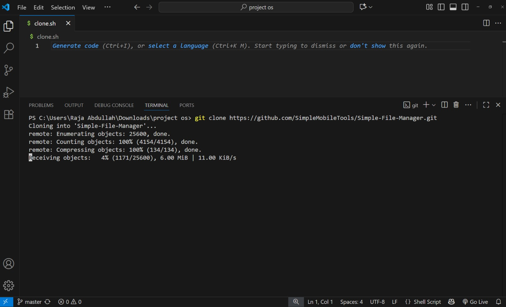

# ProjectOS  

This is my Operating System project.  

## 📌 How to Run  
1. Download all project files.  
2. Open the code in VS Code.  
3. Run using terminal or required software.  

## 📸 Screenshots  
  

## 👩‍💻 Author  
Rimsha mohsin, alishba shareef,maryam shehzadi(BSCS Student)
